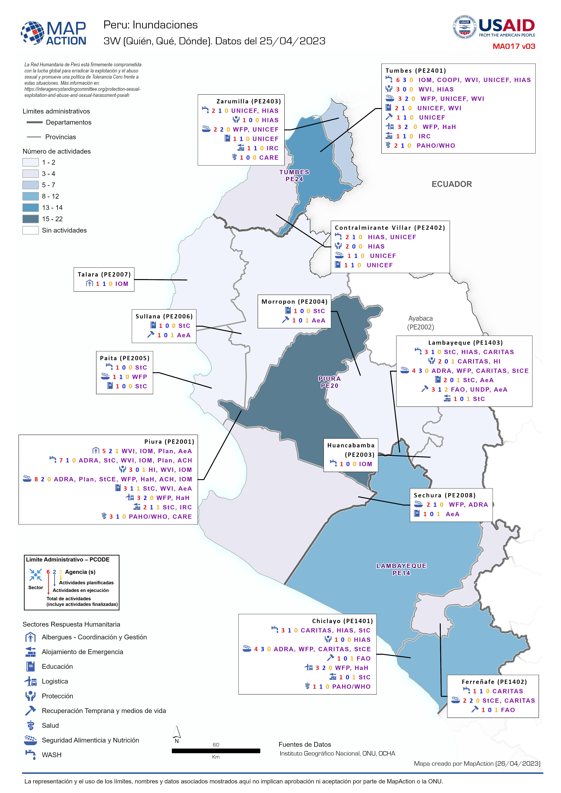

# data-3W-4W-notebook
This repository contains the Jupyter Notebook developed to work with 3W-4W data as part of a response. The output of the notebook is a geopackage that can be used to create the map labels as per MapAction process, an example of the map and labels can be seen below:

